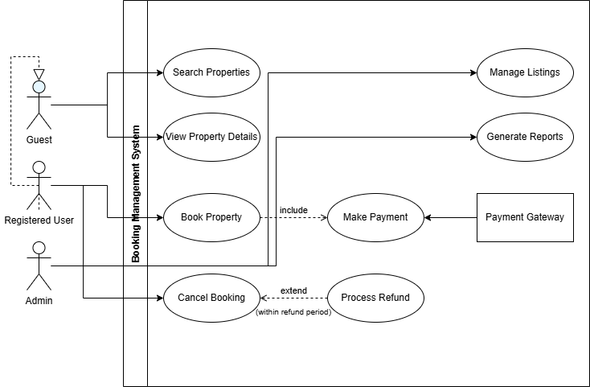

# Requirement Analysis in Software Development  
This repository documents the requirement analysis process for a booking management system, following SDLC best practices to ensure clear, actionable specifications.

---

## 1. What is Requirement Analysis?  
**Requirement Analysis** is the systematic process of identifying, documenting, validating, and managing software requirements. It bridges stakeholder needs with technical implementation by:  
- Eliciting user expectations and business objectives  
- Translating ambiguous needs into measurable specifications  
- Establishing acceptance criteria for deliverables  

**SDLC Importance**: Serves as the foundation for design/development, reducing rework by 60% and preventing scope creep.

---

## 2. Why is Requirement Analysis Important?  
1. **Risk Mitigation**: Identifies conflicting requirements early (e.g., 70% fewer change requests)  
2. **Resource Optimization**: Prioritizes high-impact features for efficient development  
3. **Stakeholder Alignment**: Creates shared understanding between business/technical teams  
4. **Quality Assurance**: Establishes testable criteria before coding begins  

---

## 3. Key Activities in Requirement Analysis  
### Requirement Gathering  
- Conduct stakeholder interviews/surveys  
- *Output*: Raw requirement statements  
### Requirement Elicitation  
- Refine requirements via prototyping/workshops  
- *Output*: Contextual user stories  
### Requirement Documentation  
- Create structured artifacts:  
  - Software Requirements Specification (SRS)  
  - Use case diagrams  
### Requirement Analysis and Modeling  
- Decompose requirements into functional components  
- *Tools*: UML diagrams, flowcharts  
### Requirement Validation  
- Formal review with stakeholders  
- *Methods*: Walkthroughs, feasibility analysis  

---

## 4. Types of Requirements  
### Functional Requirements  
*What the system must do*  
**Booking System Examples**:  
1. "Users shall search properties by location/date"  
2. "Admins shall approve/reject property listings within 24h"  
3. "System shall process payments via Stripe/PayPal"  

### Non-Functional Requirements  
*How the system performs*  
**Booking System Examples**:  
1. **Performance**: "Search results load ≤2s for 10k concurrent users"  
2. **Security**: "PCI-DSS compliant payment processing"  
3. **Usability**: "First-time user completes booking in ≤3 steps"  

---

## 5. Use Case Diagrams  
**Definition**: Visual representations of system interactions between actors and use cases.  
**Benefits**:  
- Identify system boundaries  
- Clarify actor responsibilities  
- Reveal missing requirements  

  
*Sample diagram for booking system*

---

## 6. Acceptance Criteria  
**Purpose**: Define testable conditions that determine feature completeness.  

**Example for Checkout Feature**:  
```gherkin
Scenario: Successful Booking Payment  
Given A user with valid payment details  
When They complete the checkout process  
Then:  
  - Payment confirmation email is sent within 1min  
  - Booking status changes to "Confirmed"  
  - Calendar event is created in user's account  
  - Inventory decreases by 1 unit
